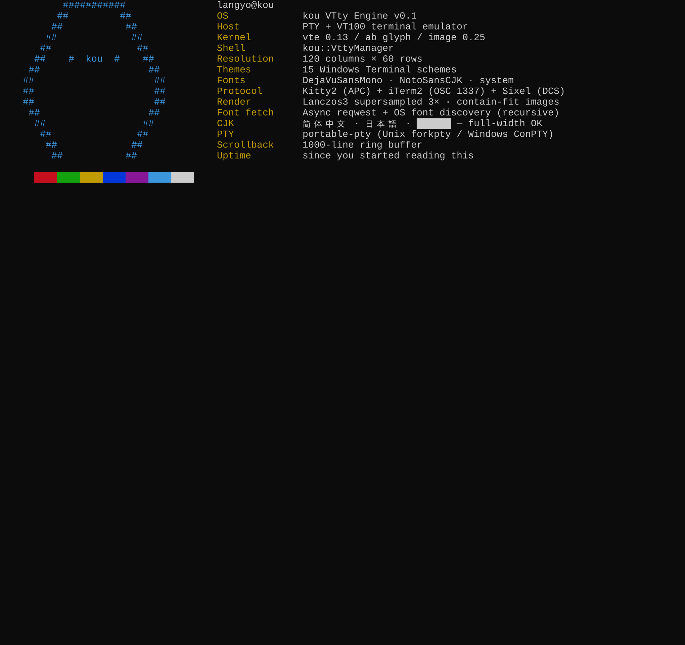

<p align="center"></p>

<h1 align="center">Kou</h1>

<p align="center"><strong>Virtual terminal engine</strong></p>

<div align="center">

[](https://sysl.celestia.world)
[](https://github.com/celestia-island/kou)
[](https://github.com/celestia-island/kou/actions/workflows/checks.yml)
[](https://kou.docs.celestia.world)
[](https://docs.rs/kou)

</div>

<div align="center">

**English** ·
[简体中文](./docs/zhs/README.md) ·
[繁體中文](./docs/zht/README.md) ·
[日本語](./docs/ja/README.md) ·
[한국어](./docs/ko/README.md) ·
[Français](./docs/fr/README.md) ·
[Español](./docs/es/README.md) ·
[Русский](./docs/ru/README.md) ·
[العربية](./docs/ar/README.md)

</div>

## Introduction

kou is a standalone virtual-terminal engine — PTY management, a VT100/ANSI
screen emulator, and screen rendering that draws glyphs. It is the vtty
core extracted from the tairitsu packager, hardened into a library and CLI of its
own.

Three things set it apart from a bare PTY wrapper:

- **VT100 screen.** The byte stream is run through the [`vte`](https://crates.io/crates/vte)
  parser, so CSI cursor moves, erase, scroll and the SGR 16-colour palette are
  honoured — not the "drop ESC on the floor" stub of the early prototype.
- **Build-time font fetching.** kou pre-downloads one font per script into a
  shared cache at build time. Override families or pin local files via
  environment variables; route downloads through an HTTP(S) proxy when behind
  a restrictive network. See [Fonts & fetching](#fonts--fetching) for the
  full list.
- **Inband graphics.** A frame can be rasterised to PNG, or described to a
  capable terminal through the kitty (`kitty2`) or iTerm2 graphics protocol — so
  wezterm / kitty / iTerm2 / Ghostty render the real pixels inline.

## Quick Start

### CLI

```bash
# Launch a command in a virtual terminal and drive it from a REPL.
kou launch bash --cols 80 --rows 24
# > echo hello
# > screen        # prints the current screen text
```

### npx (no Rust toolchain required)

Prebuilt binaries are published to npm, so you can run `kou` with a single
command — no `cargo build`:

```bash
npx @celestia-island/kou launch bash
npx @celestia-island/kou mcp        # the MCP server (needs the mcp build)
```

The `@celestia-island/kou` root package pulls the right platform subpackage
(`-linux-x64` / `-darwin-arm64` / `-win32-x64`) automatically. To pin a version:

```bash
npx @celestia-island/kou@0.1.0 launch bash
```

### Library

```rust
use kou::{FontCache, FontSet, VttyManager, render_png};

#[tokio::main]
async fn main() -> anyhow::Result<()> {
    let mgr = VttyManager::new();
    let id = mgr.launch("bash", None, 80, 24).await?;
    mgr.send_text(&id, "echo hello\n").await?;

    // Plain text.
    println!("{}", mgr.screenshot(&id).await?);

    // A real PNG, rendered with auto-fetched fonts (Latin + CJK fallback).
    let fonts = FontCache::load(&FontSet::from_env(), 16.0);
    let screen = mgr.screen(&id).await?;
    let png = render_png(&screen, &fonts, 16.0)?;
    std::fs::write("screen.png", png)?;
    Ok(())
}
```

## Graphics protocols

| `KOU_GRAPHICS` | Protocol | Terminals |
|----------------|----------|-----------|
| `kitty` / `kitty2` | kitty APC graphics | kitty, wezterm, Ghostty |
| `iterm` / `iterm2` | OSC 1337 inline image | iTerm2, wezterm |
| `sixel` | DCS sixel | (placeholder — needs a rasterizer) |
| `off` (default) | none — render a PNG out of band | all |

```rust
use kou::{FontCache, FontSet, GraphicsProtocol, VttyManager, render_graphics};
let frame = render_graphics(&screen, &FontCache::load(&FontSet::from_env(), 16.0), 16.0,
                            GraphicsProtocol::from_env());
if let Some(escape) = frame {
    print!("{escape}"); // capable terminals render the pixels inline
}
```

## Fonts & fetching

kou pre-downloads one font per script into a shared cache at build time:

| Script | Font |
|--------|------|
| Latin | [Fira Code](https://github.com/tonsky/FiraCode) |
| CJK (中文 · 日本語 · 한국어) | [Source Han Sans SC](https://github.com/adobe-fonts/source-han-sans) (思源黑体) |

Override any family at build time with `KOU_FONT_PRIMARY` / `KOU_FONT_CJK`, or
pin local files with `KOU_FONT_PATH` / `KOU_FONT_CJK_PATH`. Downloads can be
routed through an HTTP(S) proxy via `KOU_DOWNLOAD_PROXY` (passed directly to
reqwest).

| Env | Purpose |
|-----|---------|
| `KOU_FONT_PRIMARY` | Override the Latin font family. |
| `KOU_FONT_CJK` | Override / disable the CJK font (`none` to disable). |
| `KOU_FONT_MIRROR` | Substitute the download host with a mirror. |
| `KOU_DOWNLOAD_PROXY` | Route downloads through an HTTP(S) proxy (reqwest). |
| `KOU_DOWNLOAD_TIMEOUT_SECS` | Per-request timeout (default 120). |
| `KOU_SKIP_FONT_FETCH` | Disable fetching. |

## MCP server

Build kou with the `mcp` feature and run the stdio server — it exposes the
virtual-terminal engine to AI coding assistants over the Model Context
Protocol (no browser or daemon required):

```bash
kou mcp
```

The server advertises eleven tools — `vtty_launch`, `vtty_kill`,
`vtty_send_keys`, `vtty_send_text`, `vtty_screenshot`, `vtty_wait`,
`vtty_ready`, `vtty_scrollback`, `vtty_resize`, `vtty_list`, `vtty_ping` —
each delegating in-process to the same `VttyManager` the library exposes.
Screenshots render through the same font + theme stack as the library, so
`vtty_screenshot` returns a real PNG (or themed text) for vision-capable
models.

Wire it into an MCP client:

```json
{
  "mcpServers": {
    "kou": { "command": "kou", "args": ["mcp"] }
  }
}
```

Set `KOU_PROJECT_ROOT` to pin the working directory for launched sessions
when the client does not advertise a project root.

## Development

```bash
cargo check --all-features
cargo fmt --all -- --check
cargo clippy --all-targets --all-features -- -D warnings
cargo test --all-features
```


<details>
<summary>Screenshots</summary>

<p align="center"></p>

</details>

## License

SySL-1.0 (Synthetic Source License). See [LICENSE](./LICENSE) or the [SySL website](https://sysl.celestia.world).
