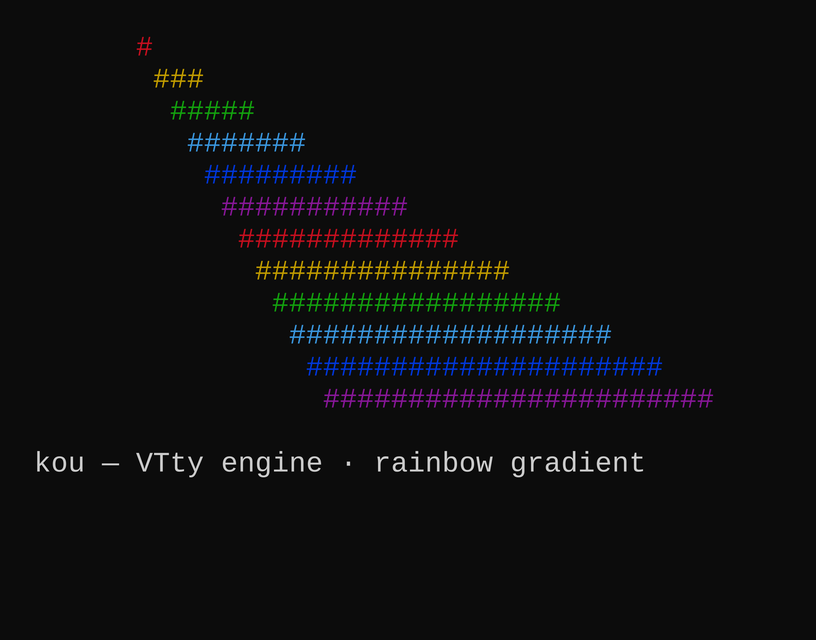

# Graphics Protocols


All three inline-image protocols support **both encoding** (write to a
terminal) and **decoding** (receive from a PTY). When kou's Screen encounters
an inline-image escape sequence, it decodes the image and stores it; the
renderer overlays each placement using contain-fit (aspect ratio preserved).

| Protocol | Direction | Format | Terminals |
|----------|-----------|--------|-----------|
| Kitty2 (APC) | Encode + Decode | base64 PNG | kitty, wezterm, Ghostty |
| iTerm2 (OSC 1337) | Encode + Decode | base64 PNG | iTerm2, wezterm |
| Sixel (DCS) | Encode + Decode | Raster language | xterm, mlterm, mintty |

Sixel encoding/decoding uses the [`icy_sixel`](https://crates.io/crates/icy_sixel)
crate (pure Rust, behind the `sixel` cargo feature).



## Driving it

```rust
use kou::{FontCache, FontSet, GraphicsProtocol, VttyManager, render_graphics, theme_by_name};

let screen = mgr.screen(&id).await?;
let fonts = FontCache::load(&FontSet::from_env(), 16.0);
let theme = theme_by_name("campbell");
if let Some(escape) = render_graphics(&screen, &fonts, 16.0, GraphicsProtocol::from_env(), theme) {
    print!("{escape}");
} else {
    let png = kou::render_png(&screen, &fonts, 16.0, theme)?;
    std::fs::write("screen.png", png)?;
}
```
