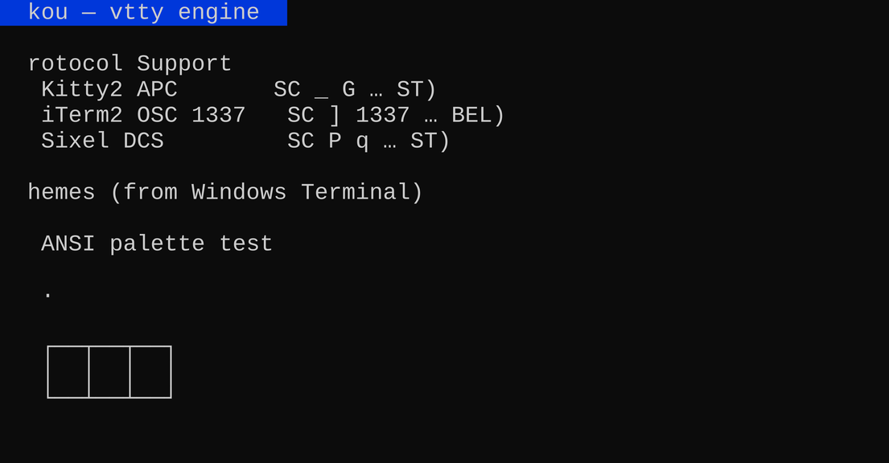
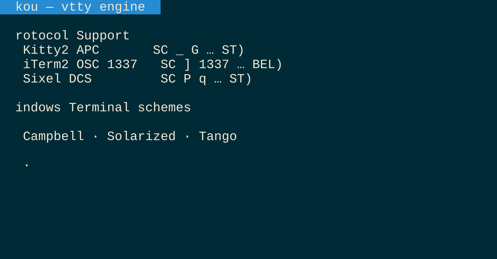

# Graphics Protocols

On top of the text grid, kou can describe a rendered frame to a capable
terminal so it draws the actual pixels inline. Select one with
`KOU_GRAPHICS`:

| Value | Protocol | Terminals |
|-------|----------|-----------|
| `kitty` / `kitty2` | kitty APC `\e_G` graphics | kitty, wezterm, Ghostty |
| `iterm` / `iterm2` | OSC 1337 inline image | iTerm2, wezterm |
| `sixel` | DCS sixel (via `icy_sixel`) | xterm, mlterm, mintty |
| `off` (default) | none — render a PNG out of band | all |



All three protocols support **both encoding** (write an image *to* a
terminal) and **decoding** (receive an image *from* a PTY). When kou's
Screen encounters an inline-image escape sequence in the PTY byte stream,
it decodes the image and stores it in an `InlineImageStore`; the renderer
overlays each placement onto the pixel canvas using contain-fit (aspect
ratio preserved, centred within the cell region).

## How it works

- **Kitty (APC).** The PNG is base64-encoded and streamed in ≤4096-byte
  chunks inside `ESC _ G … ST` frames. Decoding reassembles chunked
  transfers across PTY read boundaries via a sliding buffer.
- **iTerm2 (OSC 1337).** A single
  `ESC ]1337;File=inline=1;width=<w>cells;height=<h>cells:BASE64 BEL`
  sequence. Decoded via pre-extraction (vte cannot accumulate large OSC
  across `feed()` calls).
- **Sixel (DCS).** A bitmap raster language (`ESC P q … ST`). Encoding and
  decoding use the [`icy_sixel`](https://crates.io/crates/icy_sixel) crate
  (pure Rust, clean-room SIXEL spec implementation). Behind the `sixel`
  cargo feature.



## Driving it

```rust
use kou::{FontCache, FontSet, GraphicsProtocol, VttyManager, render_graphics};

let screen = mgr.screen(&id).await?;
let fonts = FontCache::load(&FontSet::from_env(), 16.0);
if let Some(escape) = render_graphics(&screen, &fonts, 16.0, GraphicsProtocol::from_env(), theme) {
    print!("{escape}"); // capable terminals render the pixels inline
    println!();         // advance past the placement
} else {
    // Protocol off or unsupported: fall back to a PNG.
    let png = kou::render_png(&screen, &fonts, 16.0, theme)?;
    std::fs::write("screen.png", png)?;
}
```
